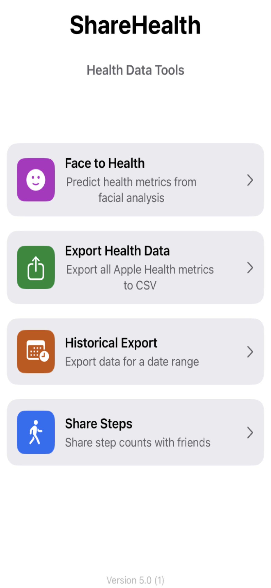
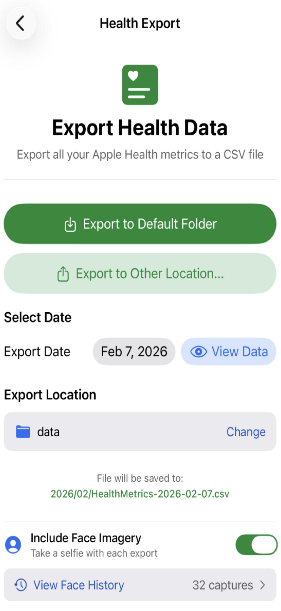
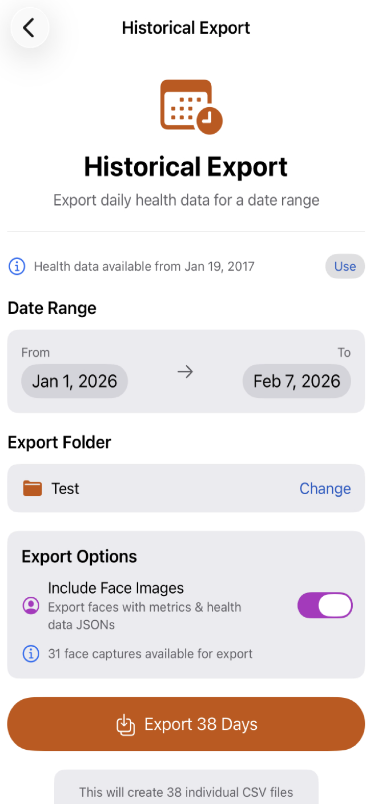
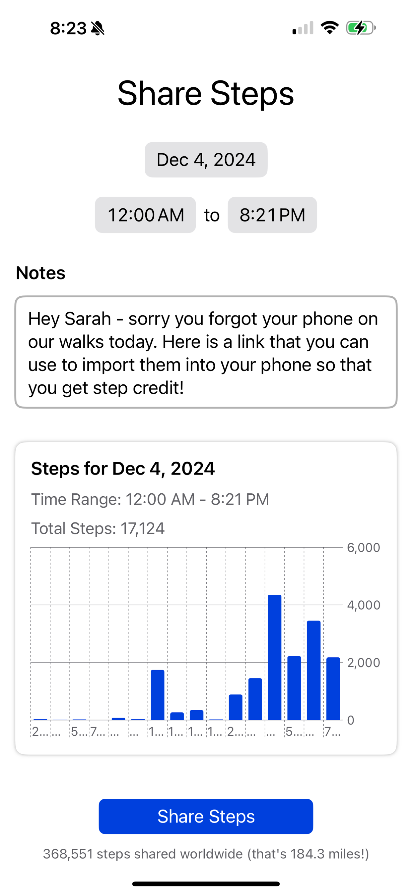
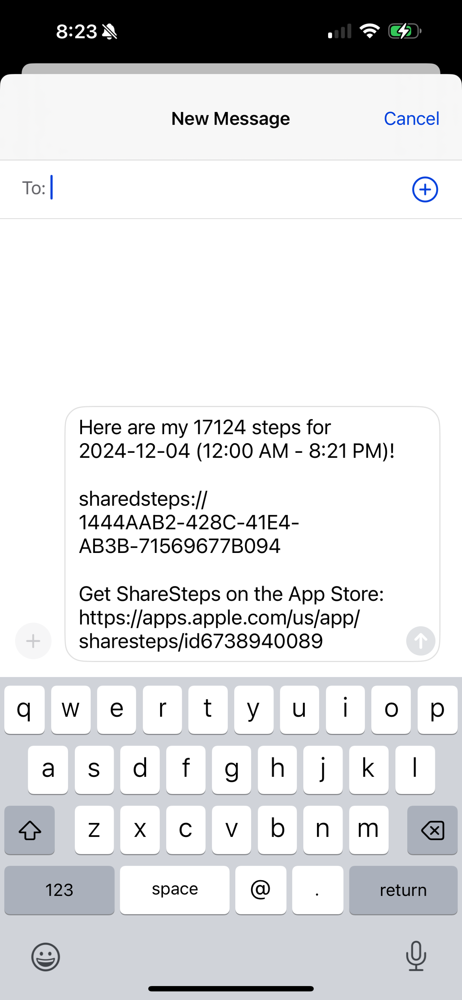
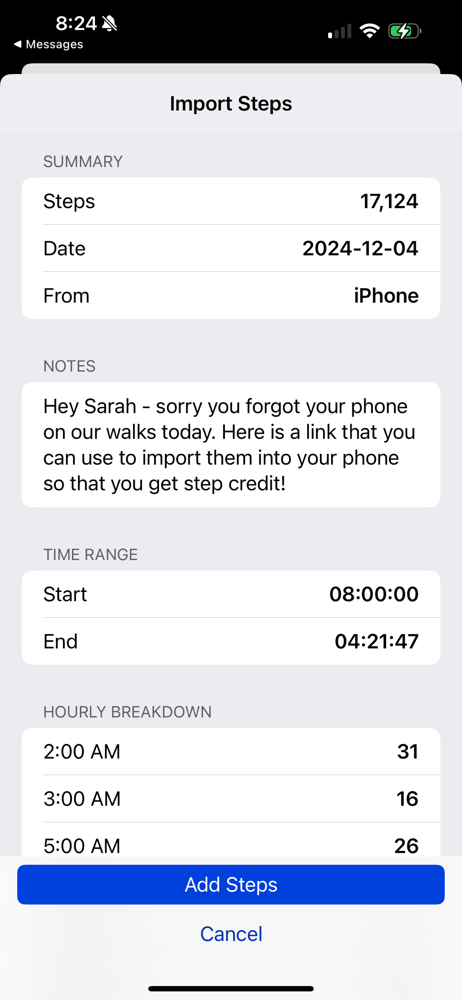

# ShareHealth

<p align="center">
  
</p>

[](https://apps.apple.com/us/app/sharehealth/id6738940089)

An iOS app for exporting Apple Health data to CSV files, with **on-device machine learning to predict health metrics from your face**.

**[Download on the App Store](https://apps.apple.com/us/app/sharehealth/id6738940089)**

## What's New in 5.0

**Face to Health** - Train personalized machine learning models that predict your health metrics from facial analysis alone. This groundbreaking feature uses MediaPipe face mesh analysis to extract 24 facial features and correlate them with your Apple Health data over time.

## Screenshots

<p align="center">
  
  
  
</p>
<p align="center">
  
  
  
</p>

## Features

### Face to Health (NEW in 5.0)

Train personalized machine learning models to predict your health metrics purely from facial analysis. After capturing enough face photos paired with health data, the app builds ridge regression models that learn YOUR unique face-to-health correlations.

#### How It Works

1. **Capture faces daily** - Take a quick selfie that gets paired with that day's health data from Apple Health
2. **Automatic model training** - After 7+ captures, models begin training using leave-one-out cross-validation
3. **View model performance** - See R correlation values, scatter plots, and prediction accuracy for each target
4. **Predict on demand** - Take a new photo anytime to get instant health predictions

#### Prediction Targets

Built-in targets:
- **Sleep Score** - Oura-inspired 0-100 score based on duration, deep sleep, REM, and efficiency
- **Heart Rate Variability (HRV)** - Predict HRV from facial stress indicators
- **Resting Heart Rate** - Predict resting HR from facial cues

Plus **custom targets** - Add any numeric health metric from your Apple Health data as a prediction target (Mindful Minutes, Blood Pressure, Weight, etc.)

#### Model Analysis & Visualization

Tap any trained model to see detailed cross-validation results:

- **Leave-One-Out Cross-Validation** - Each prediction is made by a model that never saw that sample, giving honest out-of-sample accuracy estimates
- **Scatter Plot** - Actual vs predicted values with perfect-prediction reference line
- **R Correlation** - Measures how well facial features predict the health metric (0.5+ is moderate, 0.7+ is strong)
- **MAE & RMSE** - Mean Absolute Error and Root Mean Square Error in original units
- **Feature Importance** - See which of the 24 facial features most influence predictions (eye openness, brow tension, smile intensity, etc.)
- **Prediction Errors Over Time** - Track whether the model over/under-predicts on specific days

#### 24 Facial Features Analyzed

Using MediaPipe Face Mesh, each capture extracts:
- Eye openness (left/right), blink, squint
- Brow raise (left/right), furrow
- Smile intensity (left/right), frown
- Mouth openness, lip press
- Cheek squint (left/right)
- Head pose (pitch, yaw, roll)
- Composite scores: alertness, tension, facial symmetry

#### Data Management

- **Import from exports** - Bulk import face captures and health data from your historical exports
- **Backfill health data** - Automatically fetch Apple Health data for captures that are missing it
- **View capture history** - Browse all stored face captures with their associated metrics
- **On-device storage** - All face images and models stay on your device in `Documents/faces/` and `Documents/models/`

#### Privacy-First Design

- **100% on-device** - All machine learning training and inference happens locally
- **No cloud uploads** - Your face photos and health correlations never leave your device
- **No account required** - Works completely offline after initial setup
- **You control the data** - Delete captures or purge all data anytime

---

### Health Data Export

Export 100+ Apple Health metrics to CSV format, including:
- **Activity**: Steps, flights climbed, exercise time, distances
- **Heart**: Heart rate (min/max/avg), resting HR, HRV, walking HR
- **Sleep**: Total, asleep, **time in bed**, core, deep, REM, awake durations, **bedtime** (decimal hours), **wake time** (decimal hours)
- **Vitals**: Blood pressure, body temperature, blood glucose, respiratory rate
- **Body**: Weight, height, BMI, body fat percentage, lean mass
- **Nutrition**: Calories, macros, vitamins, minerals (20+ nutrients)
- **Mobility**: Walking speed, step length, stair speed, 6-minute walk test
- **Other**: Mindful minutes, handwashing, stand hours, and more

### Sleep Timing for Analytics
Bedtime and Wake Time are exported as **decimal hours** (24-hour format) for easy use in machine learning models and data analysis:
- **Bedtime**: Earliest sleep session start time (e.g., 22.75 = 10:45 PM)
- **Wake Time**: Latest asleep sample end time before 6 PM (e.g., 6.5 = 6:30 AM)
- **Time in Bed**: Total hours spent in bed (separate from asleep time)

This format is designed for predictive analytics and health trend modeling.

### Historical Export (Date Range)
Export health data for any date range with a single batch operation:
- Select custom start and end dates
- **Automatic earliest date detection** - displays your earliest available HealthKit data with a "Use" button
- Exports one CSV file per day containing all 100+ health metrics
- Real-time progress tracking showing current day being exported
- **View Log** feature to review export details, timing, and any failed days
- **Screen stays awake** during export to prevent interruption on long exports
- **30-second timeout per day** to gracefully handle stuck HealthKit queries
- Continues to next day on failure (doesn't abort entire export)
- Separate folder selection from single-day exports for organization

### Organized Folder Structure
All exports are organized into year/month subfolders:
```
/ExportFolder/
  /2024/
    /01/
      HealthMetrics-2024-01-01.csv
      HealthMetrics-2024-01-02.csv
      ...
    /02/
      HealthMetrics-2024-02-01.csv
      ...
  /faces/
    /2024/
      /01/
        Face-2024-01-15_143022.jpg
        Face-2024-01-15_143022.json      # Facial metrics
        Face-2024-01-15_143022_health.json  # Health data snapshot
        ...
```

### Face Imagery
Optionally capture a selfie with each health export to track your appearance alongside your health metrics:
- Front-facing camera with preview
- Real-time facial analysis overlay showing detected features
- Retake option before saving
- Photos saved to `faces/YYYY/MM/` subfolder structure
- Persists preference across sessions

### Flexible Export Locations
- **Default Folder**: Set once, export with one tap
- **Dedicated Historical Export Folder**: Separate folder for batch exports
- **Share Sheet**: Export to any app (email, cloud storage, etc.)
- Works with iCloud Drive, Dropbox, Google Drive, or local storage

### Share Steps
Share your daily step counts with friends via URL scheme.

## Requirements

- iOS 18.0+
- iPhone with HealthKit support
- Xcode 16+ (for building)
- Apple Developer account

## Installation

### From Source

1. Clone the repository:
   ```bash
   git clone https://github.com/smuskal/ShareHealth.git
   cd ShareHealth
   ```

2. Open in Xcode:
   ```bash
   open ShareHealth.xcodeproj
   ```

3. Configure signing:
   - Select the `ShareHealth` target
   - Go to **Signing & Capabilities**
   - Select your development team
   - Xcode will automatically manage provisioning

4. Build and run:
   - Connect your iPhone
   - Select your device from the scheme dropdown
   - Press `Cmd+R` or click the Play button

### First Launch

1. Grant HealthKit permissions when prompted
2. Set a default export folder (optional but recommended)
3. Enable "Include Face Imagery" if desired
4. Try **Face to Health** to start building your personalized health models

## Usage

### Face to Health

1. Open the app and tap **Face to Health**
2. Tap **Capture Face** to take a selfie - health data is automatically paired
3. Repeat daily to build your dataset (7+ captures needed for training)
4. Select prediction targets (Sleep Score, HRV, etc.) to train models for
5. Tap **Retrain Models** after adding more captures
6. Tap any model with an R value to see detailed cross-validation results
7. Use **Predict My Health Now** to get instant predictions from a new photo

### Single Day Export

1. Open the app and tap **Export Health Data**
2. Select the date you want to export
3. Tap **Export to Default Folder** or **Export to Other Location**
4. If face imagery is enabled, take a selfie when prompted
5. Your CSV file will be saved to `YYYY/MM/HealthMetrics-YYYY-MM-DD.csv`

### Historical Export (Date Range)

1. Open the app and tap **Historical Export**
2. The app displays your **earliest available health data date**
3. Select start date (tap "Use" to start from earliest available)
4. Select end date
5. Choose an export folder
6. Tap **Export X Days**
7. Monitor progress - shows current day being exported
8. When complete, tap **View Log** to see details and any failures

### CSV Format

The exported CSV includes a header row with metric names and units, followed by a single data row with values for the selected date. Format is compatible with spreadsheet applications and data analysis tools.

Example columns:
```
Date/Time, Active Energy (kcal), Step Count (count), Heart Rate [Avg] (count/min), Sleep Analysis [Total] (hr), Bedtime, Wake Time, ...
```

**Sleep Data Fields:**
- `Sleep Analysis [In Bed] (hr)`: Hours spent in bed (may differ from asleep time)
- `Bedtime`: Decimal hour when sleep session started (24-hour format)
- `Wake Time`: Decimal hour when final sleep ended (morning wake-up)
- Example values: `22.75` = 10:45 PM, `6.5` = 6:30 AM
- Optimized for machine learning, predictive analytics, and sleep pattern analysis

## Project Structure

```
ShareHealth/
├── ShareStepsApp.swift          # App entry point
├── MainMenuView.swift           # Main navigation
├── FaceToHealthView.swift       # Face to Health main UI
├── FaceHealthModelTrainer.swift # On-device ML training (ridge regression, LOO-CV)
├── ModelCVDetailView.swift      # Model visualization (scatter plots, feature importance)
├── FacialDataStore.swift        # Local face capture storage
├── MediaPipeFaceAnalyzer.swift  # 24-feature facial analysis
├── SleepScoreCalculator.swift   # Oura-style sleep scoring
├── HealthExportView.swift       # Single-day export UI
├── HistoricalExportView.swift   # Date range export UI
├── HealthDataExporter.swift     # HealthKit data fetching
├── FaceCaptureView.swift        # Camera capture UI
├── ContentView.swift            # Share Steps feature
├── StepsChartView.swift         # Step visualization
└── ...
```

## Privacy

This app:
- **No account required** - just download and use
- **100% on-device ML** - all model training happens locally, never in the cloud
- Reads health data locally from Apple HealthKit
- Does not transmit health data or face photos to any external servers
- Stores exports only where you choose to save them
- Face photos for ML are stored locally in Documents/faces/
- Trained models are stored locally in Documents/models/
- All data stays on your device or your chosen cloud storage

## Permissions Required

| Permission | Purpose |
|------------|---------|
| HealthKit (Read) | Access health metrics for export and Face to Health training |
| HealthKit (Write) | Save imported step data from friends |
| Camera | Capture face photos for export and Face to Health |
| File Access | Save exports to selected folder |

## Version History

- **5.0 (Build 1)** - **Face to Health**: On-device machine learning to predict health metrics from facial analysis. MediaPipe face mesh with 24 features, ridge regression with leave-one-out cross-validation, scatter plots, feature importance visualization, custom prediction targets, Sleep Score calculation, bulk import from exports, health data backfill
- **3.2 (Build 2)** - Bug fixes and improvements
- **3.0 (Build 3)** - Historical export with date range selection, bedtime/wake time fields as decimal hours for ML/analytics, time in bed tracking, year/month folder organization, export logging with View Log feature, automatic earliest available date detection, 30-second per-day timeout protection, screen stays awake during batch exports
- **3.0 (Build 2)** - Initial 3.0 release with historical export foundation
- **2.1** - Added face imagery capture, health export improvements
- **2.0** - Added comprehensive health data export (70+ metrics)
- **1.x** - Original ShareSteps functionality

## Troubleshooting

### Face to Health Issues

**"Insufficient data for analysis" in detail view:**
- Ensure you have 7+ face captures with both facial metrics AND health data
- Try tapping "Retrain Models" from the menu to refresh
- Check that captures have health data (use "Backfill Health Data" if needed)

**Model shows low R correlation (< 0.3):**
- This is normal early on - more data improves accuracy
- Some metrics may not correlate strongly with facial features for your physiology
- Try capturing at consistent times of day
- Ensure good lighting for accurate facial analysis

**Predictions seem off:**
- Remember: these are personalized models trained on YOUR data
- Models improve with more diverse samples (good days and bad days)
- Check the scatter plot to see prediction variance

### Historical Export Issues

**Export seems to stop mid-way:**
- Keep the app in foreground during export
- The screen stays awake automatically
- Check the View Log for failed days
- Each day has a 30-second timeout to prevent hanging

**Files not appearing in Dropbox:**
- Files are written to local Dropbox cache first
- Dropbox uploads them to cloud in the background
- Check Files app → Dropbox to see local files
- Keep Dropbox app open to speed up uploads

**No sleep data for older years:**
- Native Apple sleep tracking started in September 2020 (iOS 14)
- Earlier sleep data requires third-party apps (Sleep Cycle, AutoSleep, etc.)
- CSVs will still export with other metrics; sleep fields will be empty

## Face to Health Data Format

### On-Device Storage Structure

Face captures are stored in the app's Documents directory:

```
Documents/
└── faces/
    └── YYYY/                              # Year folder (e.g., 2024)
        └── MM/                            # Month folder (01-12)
            ├── Face-YYYY-MM-DD_HHMMSS.jpg         # Face image (JPEG, 85% quality)
            ├── Face-YYYY-MM-DD_HHMMSS.json        # Facial metrics (24 features)
            └── Face-YYYY-MM-DD_HHMMSS_health.json # Health snapshot from Apple Health
```

### File Naming Convention

Files use the format: `Face-YYYY-MM-DD_HHMMSS`
- Example: `Face-2024-03-15_143022` = March 15, 2024 at 2:30:22 PM

### Facial Metrics JSON Structure

The `.json` file contains 24 MediaPipe-compatible facial features:

```json
{
  "timestamp": "2024-03-15T14:30:22Z",
  "mediaPipeFeatures": {
    "eyeOpennessLeft": 0.85,      // 0-1, how open the left eye is
    "eyeOpennessRight": 0.82,     // 0-1, how open the right eye is
    "eyeBlinkLeft": 0.05,         // 0-1, blink intensity
    "eyeBlinkRight": 0.08,
    "browRaiseLeft": 0.15,        // 0-1, eyebrow raise
    "browRaiseRight": 0.18,
    "browFurrow": 0.02,           // 0-1, forehead tension
    "mouthOpen": 0.12,            // 0-1, jaw opening
    "mouthSmileLeft": 0.45,       // 0-1, smile intensity
    "mouthSmileRight": 0.48,
    "mouthPucker": 0.0,           // 0-1, lip pucker
    "jawOpen": 0.08,
    "cheekPuffLeft": 0.0,
    "cheekPuffRight": 0.0,
    "noseWrinkle": 0.0,
    "headPitch": 2.5,             // degrees, normalized -45 to +45
    "headYaw": -1.2,
    "headRoll": 0.3,
    "faceWidth": 0.42,            // normalized to image size
    "faceHeight": 0.58,
    "eyeDistance": 0.18,
    "noseMouthDistance": 0.12,
    "mouthWidth": 0.15,
    "faceCenterX": 0.5
  },
  "healthIndicators": {
    "alertnessScore": 75.0,       // 0-100, derived from eye/brow metrics
    "tensionScore": 20.0,         // 0-100, derived from brow/mouth tension
    "smileScore": 65.0,           // 0-100, derived from smile intensity
    "facialSymmetry": 92.0        // 0-100, left/right comparison
  },
  "metadata": {
    "imageWidth": 1080,
    "imageHeight": 1920,
    "faceConfidence": 0.98,
    "landmarkCount": 468
  }
}
```

### Health Snapshot JSON Structure

The `_health.json` file contains Apple Health data from that day:

```json
{
  "Step Count (count)": "8543",
  "Heart Rate [Avg] (count/min)": "72.5",
  "Resting Heart Rate (count/min)": "58",
  "Heart Rate Variability (ms)": "45.2",
  "Sleep Analysis [Total] (hr)": "7.25",
  "Active Energy Burned (kcal)": "425.8"
}
```

### Import from Export Folder

Use this to import face captures from a backup, cloud sync, or another device.

**How to Use:**
1. Menu (⋯) → "Import from Export Folder"
2. Select a folder containing face captures
3. The app scans recursively for `Face-*.jpg` files

**Expected Folder Structure (any of these work):**

```
# Option 1: Year/Month structure (same as export)
export-folder/
└── faces/
    └── 2024/
        └── 03/
            ├── Face-2024-03-15_143022.jpg
            ├── Face-2024-03-15_143022.json
            └── Face-2024-03-15_143022_health.json

# Option 2: Flat structure
export-folder/
├── Face-2024-03-15_143022.jpg
├── Face-2024-03-15_143022.json
└── Face-2024-03-15_143022_health.json

# Option 3: AI Steve pipeline (annotations subfolder)
export-folder/
├── Face-2024-03-15_143022.jpg
├── annotations/
│   └── mediapipe/
│       └── Face-2024-03-15_143022.json
└── Face-2024-03-15_143022_health.json
```

**Import Requirements:**
- Image filename must be `Face-YYYY-MM-DD_HHMMSS.jpg`
- Metrics JSON is **required** (same name with `.json`)
- Health JSON is **optional** (use Backfill to fetch from Apple Health)

**After Import:**
- Health data is automatically backfilled if missing
- Models are automatically retrained
- Duplicates are skipped

### Import from Photos

Import existing photos from your library:

1. Menu (⋯) → "Import from Photos"
2. Grant photo library access when prompted
3. Select up to 100 photos containing faces
4. The app will:
   - Analyze each photo with Vision framework
   - Use the photo's original creation date
   - Skip photos with no detectable face
   - Auto-backfill health data
   - Auto-retrain models

**Note:** Only photos with clearly visible faces will import successfully.

## The Science Behind Face to Health

Face to Health uses established computer vision and machine learning techniques:

1. **MediaPipe Face Mesh** extracts 468 facial landmarks in real-time
2. **Feature engineering** converts landmarks into 24 interpretable metrics (eye openness, brow position, smile intensity, etc.)
3. **Ridge regression** (L2-regularized linear regression) learns correlations between facial features and health metrics
4. **Leave-one-out cross-validation** provides honest accuracy estimates by testing each prediction on held-out data
5. **Personalized models** - trained only on YOUR data, so they learn YOUR unique patterns

This approach is inspired by research showing correlations between facial appearance and physiological states (fatigue, stress, cardiovascular health). By training on your personal data over time, the models can potentially detect subtle patterns specific to you.

**Important**: This is an experimental feature for personal insight and curiosity. It is not a medical device and should not be used for medical decisions.

## Links

- [Download on the App Store](https://apps.apple.com/us/app/sharehealth/id6738940089)
- [Website](https://www.molseek.com/sharehealth)
- [AI Steve Deep Dive (Medium)](https://medium.com/@smuskal/ai-steve-deep-dive-9f8352bc544d)
- [AI Steve Deep Dive (Substack)](https://www.drstevenmuskal.com/p/ai-steve-deep-dive)

## License

MIT License - See [LICENSE](LICENSE) for details.

## Acknowledgments

Built with SwiftUI, HealthKit, AVFoundation, and MediaPipe.
